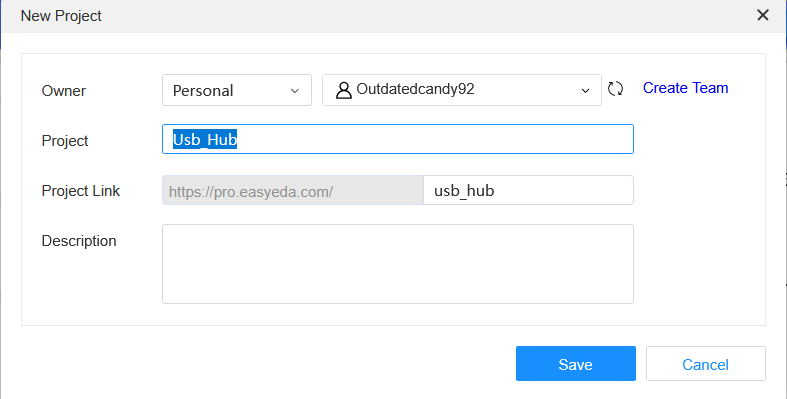
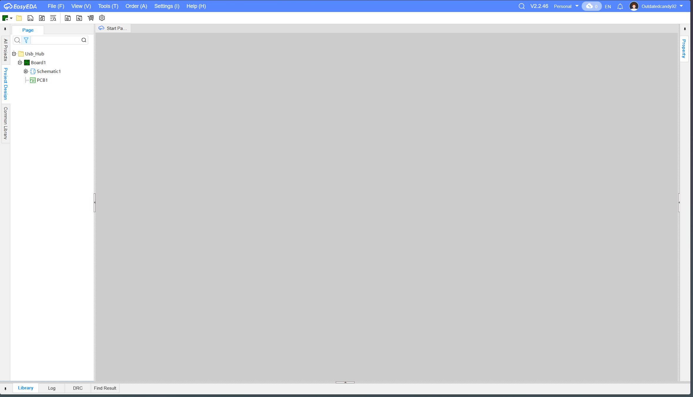
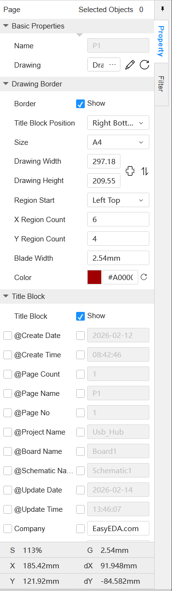
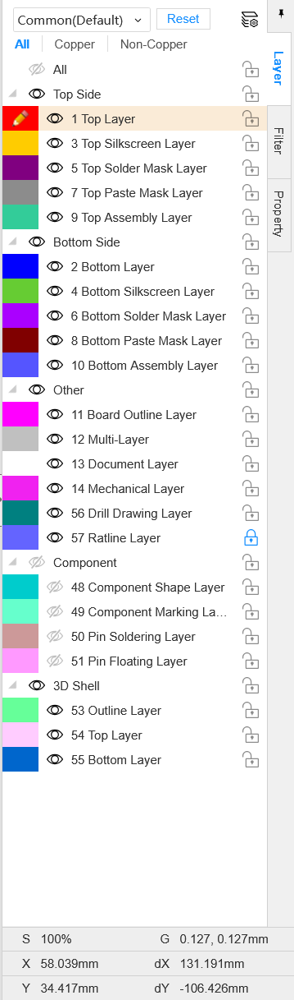
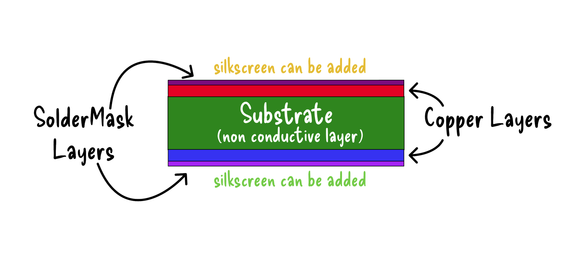

# Getting Started
made by @Rudy

For this tutorial we're going to be using `EasyEDA Pro` , it's a free and online tool that we'll use to design our fancy USB hub!

To get started head on over to [pro.easyeda.com](https://pro.easyeda.com/) and create an account and login.

After you successfully login click on the `Use Online` button or just head over to [pro.easyeda.com/editor](https://pro.easyeda.com/editor). When the editor opens, you will be taken to the main dashboard which should look something like this.

To create a project you go `File -> New -> Project` or you can just use the `Shift + N` shortcut. A new project dialog will pop up and here you can name your project and add a little description if you want.

After you save it, the editor will automatically open that project and this is what it should look like.

On the left sidebar you'll see your project name and then a `Schematic1` and `PCB` under it, these are the files which we will be working on and editing to create our USB Hub!

Before we jump into making our USB Hub, I'll give you a quick rundown of the Schematic and PCB editors in EasyEDA.

# Schematic Editor

To open the schematic editor simply double click the `Schematic1` that's on the left sidebar. It should open the schematic editor which would look something like this:

The schematic editor is where you design the circuit for your board. It visually represents how everything connects, using symbols instead of physical components. This is where you define the logic of your design. If someone understands your schematic, they understand how your circuit works, even without seeing the actual PCB.

	If the PCB editor is building the house, the schematic editor is the blueprint. It defines what goes where and how everything is connected before you worry about the physical layout.

At the top of the screen, you’ll see the toolbar. This is where all the tools you’ll need for building your schematic live. You’ll find options to add components, draw wires, place resistors, add net flags, and more.

It might look a little overwhelming at first. That’s totally normal. Let’s quickly go over the most important tools so you know what’s what. You’ll get more hands on practice with them in the next tutorial.

**Components**  
This tool lets you add symbols from the parts library. You can search for things like microcontrollers, connectors, regulators, and more, then place their symbols into your schematic.

**Resistor**  
This is a shortcut for quickly placing a resistor symbol. If you right click it, you’ll see options for other common passive components like capacitors, inductors, and diodes. These are used so often that they get their own quick access tool.

**Wire**  
Pretty self explanatory. This tool lets you draw wires to connect different components together.

**Net Flag/Label**  
Think of this as a cleaner way to connect things. Instead of drawing a long wire across your schematic, you can place net flags and give them the same name. If two net flags share a name, they’re electrically connected, even if there’s no visible wire between them. This helps keep your schematic neat and easy to read.

Now on the right side you have the property sidebar, it basically shows you the property of whatever component is selected, by default if nothing is selected it shows you the properties of the page.

# PCB Editor

To open the PCB editor, simply click the `PCB1` on the left sidebar. That opens the PCB editor which looks something like this.

The PCB editor is where your design becomes real. This is where you define how your board will physically look and connect in real life. You’ll set the board shape, arrange components on the layout, and draw copper traces that connect everything together.

	Unlike the schematic editor, which focuses on logic, the PCB editor is all about physical placement and routing. You’re thinking about spacing, trace paths, and how everything fits on the board.

Just like the schematic editor, the PCB editor also has a toolbar at the top with the tools you’ll use most often. Don’t worry if they look unfamiliar at first. Here’s a quick and simple rundown of the first five tools, without getting too technical:

**Pad**  
Pads are the copper landing points where component leads or pins get soldered. Every footprint is made up of pads, and you can also place custom pads if needed.

**Via**  
A via is a small hole that connects copper traces between different layers of the board. For example, it lets you route a trace from the top layer to the bottom layer.

**Board Outline**  
This defines the actual shape and size of your PCB. Whatever you draw here is what the manufacturer will cut out.

**Copper Area**  
This tool lets you create large copper regions, usually for things like ground planes or power planes. Instead of routing lots of individual traces, you can pour a copper area and connect it to a specific net.

**Fill Region**  
Similar to a copper area, but more general purpose. It fills a defined space with copper and is often used for shielding or custom copper shapes.

On the right sidebar, you’ll see a long list of layers. At first glance, it can look a little intimidating. There are a lot of them, and the names might not immediately make sense.

But don’t worry. For most beginner boards, you only really need to focus on five layers: the **Top Layer**, **Bottom Layer**, **Top Silkscreen**, **Bottom Silkscreen**, and the **Board Outline Layer**. And which you'll learn more about in the follow section which talks about the anatomy of a PCB

## Anatomy of a PCB

At its core, a standard 2 layer PCB is pretty simple. It’s made of two copper layers separated by a non conductive material called the substrate. The substrate is usually FR4, which gives the board its strength and structure while keeping the copper layers electrically isolated from each other.

Now, we cannot just leave the copper exposed. Bare copper would oxidize over time and could easily short against other conductive surfaces. To protect it, manufacturers cover most of the copper with something called solder mask. This is a thin, non conductive protective coating. You can think of it like paint for your PCB. It protects the copper and helps prevent accidental solder bridges.

On top of the solder mask, there is the silkscreen layer. This is where text and graphics are printed onto the board. Component names, reference designators like R1 or U2, polarity markings, and even logos all go here. It does not carry electricity. It is purely for labeling and clarity, which becomes extremely helpful when assembling, debugging, or modifying your board later.

Here’s a quick illustration to help you picture how these layers are stacked together:

---

Now that you understand the basics and feel comfortable navigating EasyEDA, it’s time to put that knowledge into practice. Let’s build a USB hub!